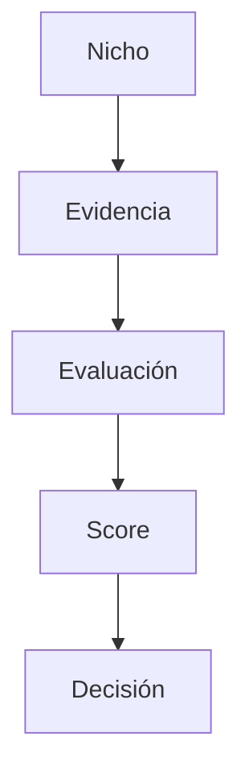

# SI-DOC-001 — Documentation Standards

> **Un proyecto que documenta cómo piensa puede crecer sin perder su identidad.**

---

## 1. Propósito

Este documento define los estándares de documentación para **Smart Imports**.

Su objetivo es asegurar que toda la documentación del proyecto sea:

- Fácil de leer.
- Fácil de mantener.
- Fácil de versionar.
- Fácil de buscar.
- Útil para personas.
- Útil para futuros agentes de IA.
- Consistente en todo el proyecto.

La documentación de Smart Imports no debe tratarse como una colección de archivos aislados. Debe tratarse como una **base de conocimiento estructurada**.

---

## 2. Alcance

Este estándar aplica a todos los documentos Markdown creados para Smart Imports, incluyendo:

- Documentos de visión.
- Manuales de negocio.
- Business Intelligence Manual.
- Especificaciones funcionales.
- Especificaciones técnicas.
- Especificaciones de agentes de IA.
- Investigación de mercado.
- Documentación de marca.
- Roadmaps.
- Decision Log.
- Meeting notes.
- Documentos de sprint.

Este documento no define estilo de código, convenciones de base de datos, convenciones de APIs ni flujo de trabajo Git. Esos temas serán definidos en estándares separados.

---

## 3. Principios centrales

### SI-DOC-P001 — La documentación es un activo del proyecto

La documentación no es trabajo secundario. Es parte del producto y parte del negocio.

### SI-DOC-P002 — Las decisiones deben ser trazables

Toda decisión estratégica, funcional o técnica importante debe poder rastrearse hasta un contexto y una justificación documentada.

### SI-DOC-P003 — Markdown es el formato por defecto

Toda documentación del proyecto debe escribirse en Markdown, salvo que exista una razón clara para usar otro formato.

### SI-DOC-P004 — Los metadatos deben ser legibles por máquinas

Los documentos deben incluir YAML front matter para que futuras herramientas, sitios estáticos, motores de búsqueda o agentes de IA puedan procesarlos de forma confiable.

### SI-DOC-P005 — Un documento, un propósito

Cada documento debe tener un propósito claro y evitar mezclar temas no relacionados.

### SI-DOC-P006 — La documentación debe servir a sus lectores reales

La documentación debe escribirse en el idioma y nivel adecuado para las personas que van a usarla. Smart Imports tendrá lectores técnicos y no técnicos; ambos deben poder acceder a la información que necesitan.

---

## 4. Política de idioma

Smart Imports utilizará una política de idioma híbrida.

La regla general es:

> **Metadatos y convenciones técnicas en inglés. Contenido estratégico, funcional, comercial y operativo en español.**

---

### 4.1 Metadatos y convenciones técnicas

Deben escribirse en inglés:

- Claves del YAML front matter.
- Nombres de carpetas.
- Nombres de archivos.
- Identificadores de documentos.
- Convenciones de Git.
- Convenciones de código.
- Nombres de ramas.
- Nombres de servicios técnicos.
- Términos técnicos estándar cuando corresponda.

Ejemplo correcto:

```yaml
---
id: si-doc-001
title: Documentation Standards
description: Estándar documental para Smart Imports.
version: 0.2.0
status: draft
owner: Alejandro Gelormini
reviewer: CTO/CSO Virtual
created: 2026-07-01
updated: 2026-07-01
tags:
  - documentation
  - standards
---
```

Ejemplo incorrecto:

```yaml
---
codigo: si-doc-001
titulo: Estándares de documentación
estado: borrador
propietario: Alejandro Gelormini
---
```

---

### 4.2 Contenido estratégico, funcional y de negocio

Debe escribirse en español:

- Visión.
- Misión.
- Valores.
- Manual de negocio.
- Business Intelligence Manual.
- Criterios de evaluación.
- Metodología de investigación.
- Análisis de nichos.
- Justificación de puntajes.
- Decision Log.
- Meeting notes.
- Documentos para socios.
- Roadmaps de negocio.
- Documentos comerciales.
- Materiales de presentación.

Motivo:

Smart Imports será compartido con personas no técnicas y con socios de negocio que pueden no manejar inglés. La documentación debe alinear personas, no excluirlas.

---

### 4.3 Documentación técnica

La documentación estrictamente técnica puede usar una mezcla de español e inglés.

Debe mantenerse en inglés cuando se trate de:

- Código.
- APIs.
- Entidades.
- Campos de base de datos.
- Variables.
- Nombres de funciones.
- Nombres de módulos.
- Convenciones de infraestructura.
- Ejemplos técnicos.

Ejemplo:

```typescript
calculateWeightedScore(nicheId: string): Promise<number>
```

La explicación funcional de ese código puede estar en español:

> Esta función calcula el score ponderado de un nicho tomando las evaluaciones cargadas y los pesos definidos para cada criterio.

---

### 4.4 Términos técnicos aceptados en inglés dentro de textos en español

Se permite utilizar términos técnicos en inglés cuando sean estándar o más claros que su traducción.

Ejemplos:

- sprint
- roadmap
- scoring
- dashboard
- repository
- markdown
- front matter
- backlog
- framework
- API
- endpoint
- agent
- prompt
- workflow
- pipeline
- stack
- deployment

---

### 4.5 Criterio práctico

Cuando exista duda, aplicar esta regla:

> Si el texto está destinado a personas de negocio, escribirlo en español.  
> Si el texto está destinado a herramientas, código o convenciones técnicas, usar inglés.

---

## 5. Formato estándar de documentos

Todos los documentos Markdown formales deben usar la siguiente estructura base:

```markdown
---
id: document-id
title: Document Title
description: Descripción breve del documento.
version: 0.1.0
status: draft
owner: Owner Name
reviewer: Reviewer Name
created: YYYY-MM-DD
updated: YYYY-MM-DD
tags:
  - tag-one
  - tag-two
---

# DOCUMENT-ID — Título del documento

> Frase estratégica opcional.

---

## 1. Propósito

...

## 2. Alcance

...

## 3. Contenido

...

## 4. Decisiones relacionadas

...

## 5. Preguntas abiertas

...

## 6. Changelog

...
```

No todos los documentos necesitan todas las secciones, pero todo documento formal debe respetar esta estructura salvo que exista una razón fuerte para no hacerlo.

---

## 6. YAML Front Matter Standard

Todo documento formal debe comenzar con YAML front matter.

### 6.1 Campos obligatorios

| Field | Descripción | Ejemplo |
|---|---|---|
| `id` | Identificador único del documento | `si-doc-001` |
| `title` | Título legible del documento | `Documentation Standards` |
| `description` | Descripción breve | `Estándar documental para Smart Imports.` |
| `version` | Versión semántica | `0.2.0` |
| `status` | Estado del documento | `draft` |
| `owner` | Responsable principal | `Alejandro Gelormini` |
| `reviewer` | Revisor o contraparte estratégica | `CTO/CSO Virtual` |
| `created` | Fecha de creación | `2026-07-01` |
| `updated` | Fecha de última actualización | `2026-07-01` |
| `tags` | Etiquetas de búsqueda | `documentation`, `standards` |

### 6.2 Campos opcionales

| Field | Descripción | Ejemplo |
|---|---|---|
| `related` | Documentos relacionados | `[si-00, si-git-001]` |
| `depends_on` | Documentos requeridos previamente | `[si-doc-001]` |
| `supersedes` | Documento reemplazado | `old-doc-id` |
| `audience` | Lectores esperados | `founder`, `partner`, `developer` |
| `phase` | Fase del proyecto | `foundation` |

---

## 7. Estados documentales

Sólo deben utilizarse los siguientes valores para `status`:

| Status | Significado |
|---|---|
| `draft` | Versión inicial, todavía en construcción. |
| `review` | Lista para revisión. |
| `approved` | Aceptada como referencia vigente del proyecto. |
| `deprecated` | Ya no recomendada, conservada por historial. |
| `archived` | Documento histórico, no mantenido activamente. |

### Reglas de estado

- Todo documento nuevo comienza como `draft`.
- Un documento pasa a `review` cuando está listo para ser evaluado.
- Sólo los documentos aceptados explícitamente por el Founder pueden pasar a `approved`.
- Los documentos deprecated no deben eliminarse salvo que exista una razón fuerte.
- Los documentos archived se conservan para trazabilidad.

---

## 8. Estándar de versionado

Los documentos de Smart Imports utilizan versionado semántico:

```text
MAJOR.MINOR.PATCH
```

Ejemplo:

```text
0.2.0
```

### Significado

| Tipo de cambio | Ejemplo | Impacto de versión |
|---|---|---|
| Cambio estructural mayor | Redefinir la metodología | `1.0.0` → `2.0.0` |
| Agregado relevante | Nueva sección | `0.1.0` → `0.2.0` |
| Corrección menor | Corrección de typos | `0.1.0` → `0.1.1` |

### Versiones iniciales

- Los documentos tempranos deben comenzar en `0.1.0`.
- La primera versión aprobada normalmente debería ser `1.0.0`.

---

## 9. Convención de nombres de archivos

### 9.1 Regla general

Los nombres de archivos deben ser:

- En minúscula.
- Descriptivos.
- Separados por guiones.
- Sin espacios.
- Sin acentos.
- En inglés cuando sea posible, especialmente para documentación técnica y estructura de repositorio.

Correcto:

```text
si-doc-001-documentation-standards.md
```

Incorrecto:

```text
SI DOC 001 Estándares de documentación.md
```

### 9.2 Patrón recomendado

```text
<document-id>-<short-title>.md
```

Ejemplos:

```text
si-doc-001-documentation-standards.md
si-00-sprint-0-foundation.md
si-bim-001-demand-evaluation.md
```

---

## 10. Estructura inicial de carpetas

La estructura inicial recomendada para la documentación es:

```text
docs/
├── 00-vision/
│   └── README.md
├── 01-business-manual/
│   └── README.md
├── 02-business-intelligence-manual/
│   ├── README.md
│   └── criteria/
│       ├── si-bim-001-demand-evaluation.md
│       ├── si-bim-002-competition-evaluation.md
│       └── si-bim-003-margin-evaluation.md
├── 03-functional-specifications/
│   └── README.md
├── 04-technical-specifications/
│   └── README.md
├── 05-ai-agents/
│   └── README.md
├── 06-research/
│   └── README.md
├── 07-brand/
│   └── README.md
├── 08-roadmaps/
│   └── README.md
├── 09-decision-log/
│   └── README.md
└── standards/
    └── si-doc-001-documentation-standards.md
```

### Propósito de cada carpeta

| Carpeta | Propósito |
|---|---|
| `00-vision` | Visión, misión, propósito y principios. |
| `01-business-manual` | Modelo de negocio y lógica operativa. |
| `02-business-intelligence-manual` | Metodología de investigación y scoring. |
| `03-functional-specifications` | Comportamiento funcional de la plataforma. |
| `04-technical-specifications` | Arquitectura, base de datos, API e infraestructura. |
| `05-ai-agents` | Agentes IA, prompts, tools y workflows. |
| `06-research` | Investigación de mercado, nichos, evidencias y hallazgos. |
| `07-brand` | Identidad de marca, mensaje y posicionamiento. |
| `08-roadmaps` | Roadmaps estratégicos, técnicos, de producto e IA. |
| `09-decision-log` | Decisiones estratégicas y justificación. |
| `standards` | Estándares de documentación, Git, código y arquitectura. |

---

## 11. Convención de IDs

Los IDs deben ser estables y significativos.

### Prefijos principales

| Prefix | Área | Ejemplo |
|---|---|---|
| `si` | Documentos generales de Smart Imports | `si-00` |
| `si-doc` | Estándares de documentación | `si-doc-001` |
| `si-git` | Estándares de Git y repositorio | `si-git-001` |
| `si-biz` | Business Manual | `si-biz-001` |
| `si-bim` | Business Intelligence Manual | `si-bim-001` |
| `si-func` | Especificaciones funcionales | `si-func-001` |
| `si-tech` | Especificaciones técnicas | `si-tech-001` |
| `si-agent` | Especificaciones de agentes IA | `si-agent-001` |
| `si-research` | Documentos de investigación | `si-research-001` |
| `si-brand` | Documentos de marca | `si-brand-001` |
| `si-roadmap` | Roadmaps | `si-roadmap-001` |
| `si-decision` | Decisiones | `si-decision-001` |
| `si-mtg` | Meeting notes | `si-mtg-001` |

---

## 12. Decision Log

Toda decisión importante debe documentarse en el Decision Log.

### 12.1 Patrón de ID

```text
si-decision-001
```

### 12.2 Plantilla de decisión

```markdown
---
id: si-decision-001
title: Use Markdown as the Default Documentation Format
description: Decisión de utilizar Markdown como formato documental principal.
version: 1.0.0
status: approved
owner: Alejandro Gelormini
reviewer: CTO/CSO Virtual
created: 2026-07-01
updated: 2026-07-01
tags:
  - decision
  - documentation
---

# SI-DECISION-001 — Use Markdown as the Default Documentation Format

## 1. Contexto

...

## 2. Decisión

...

## 3. Justificación

...

## 4. Consecuencias

...

## 5. Documentos relacionados

...
```

### 12.3 Secciones obligatorias

Toda decisión debe incluir:

- Contexto.
- Decisión.
- Justificación.
- Consecuencias.
- Documentos relacionados.

---

## 13. Meeting Notes

Las conversaciones importantes del proyecto deben documentarse como meeting notes.

### Patrón de ID

```text
si-mtg-001
```

### Plantilla

```markdown
---
id: si-mtg-001
title: Meeting Title
description: Resumen breve.
version: 0.1.0
status: draft
owner: Alejandro Gelormini
reviewer: CTO/CSO Virtual
created: YYYY-MM-DD
updated: YYYY-MM-DD
tags:
  - meeting
---

# SI-MTG-001 — Título de la reunión

## 1. Objetivo

...

## 2. Temas tratados

...

## 3. Decisiones

...

## 4. Acciones pendientes

...

## 5. Preguntas abiertas

...
```

---

## 14. Documentación de investigación

Los documentos de investigación deben separar claramente:

- Evidencia.
- Interpretación.
- Score.
- Confianza.
- Próxima acción.

### Regla de evidencia

> Un score sin evidencia es sólo una opinión.

Toda investigación debe intentar responder:

```text
¿Qué sabemos?
¿Cómo lo sabemos?
¿Qué tan confiable es la evidencia?
¿Qué decisión respalda?
¿Qué falta investigar?
```

---

## 15. Tablas

Las tablas deben utilizarse cuando comparen información estructurada.

Ejemplo:

| Criterio | Score | Confianza | Justificación |
|---|---:|---|---|
| Demanda | 4 | Alta | Múltiples productos en Mercado Libre muestran más de 1000 ventas. |
| Competencia | 3 | Media | Existe competencia visible, pero fragmentada. |

Las tablas deben mantenerse legibles en Markdown plano.

---

## 16. Diagramas

Los diagramas simples pueden escribirse como texto o Mermaid.

### Diagrama de texto

```text
Nicho
  ↓
Evidencia
  ↓
Evaluación
  ↓
Score
  ↓
Decisión
```

### Mermaid



Mermaid debe preferirse cuando el documento se vaya a renderizar en GitHub o en un sitio de documentación.

---

## 17. Changelog

Todo documento formal debe incluir un changelog al final.

Ejemplo:

```markdown
## Changelog

| Version | Date | Change |
|---|---|---|
| 0.1.0 | 2026-07-01 | Initial draft. |
```

---

## 18. Documentos relacionados

Todo documento formal debe incluir una sección de documentos relacionados cuando corresponda.

Ejemplo:

```markdown
## Related Documents

- [SI-00 — Sprint 0: Foundation](../00-vision/si-00-sprint-0-foundation.md)
- [SI-GIT-001 — Repository Standards](./si-git-001-repository-standards.md)
```

---

## 19. Decisiones iniciales establecidas por este documento

### SI-DECISION-001 — Usar Markdown como formato documental principal

Smart Imports escribirá su documentación en Markdown.

### SI-DECISION-002 — Usar metadatos en inglés

Las claves del YAML front matter se escribirán en inglés.

### SI-DECISION-003 — Usar versionado semántico

Los documentos utilizarán `MAJOR.MINOR.PATCH`.

### SI-DECISION-004 — Usar una estructura documental organizada

La documentación se organizará bajo `/docs`.

### SI-DECISION-005 — Usar política de idioma híbrida

Smart Imports utilizará metadatos, nombres técnicos y convenciones de software en inglés, pero redactará el contenido estratégico, funcional, comercial y operativo en español.

---

## 20. Preguntas abiertas

- ¿Conviene publicar la documentación futura como sitio privado?
- ¿Conviene usar Docusaurus, MkDocs, Astro Starlight u otra herramienta?
- ¿La evidencia de investigación debe vivir sólo en Google Sheets, sólo en Markdown o en ambos durante la etapa inicial?
- ¿Las meeting notes deben ser obligatorias para toda sesión importante?
- ¿Cuándo un documento pasa formalmente de `draft` a `approved`?

---

## 21. Changelog

| Version | Date | Change |
|---|---|---|
| 0.1.0 | 2026-07-01 | Initial draft. |
| 0.2.0 | 2026-07-01 | Se incorporó política de idioma híbrida: metadatos y convenciones técnicas en inglés; contenido estratégico, funcional, comercial y operativo en español. |
